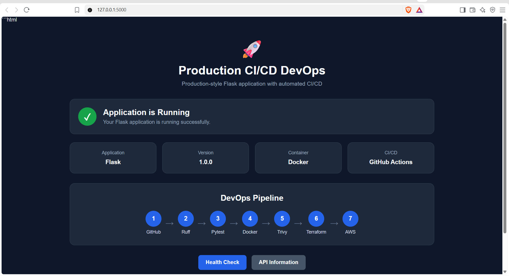
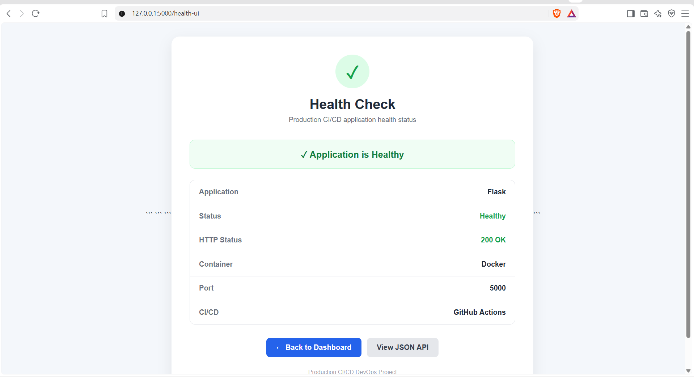
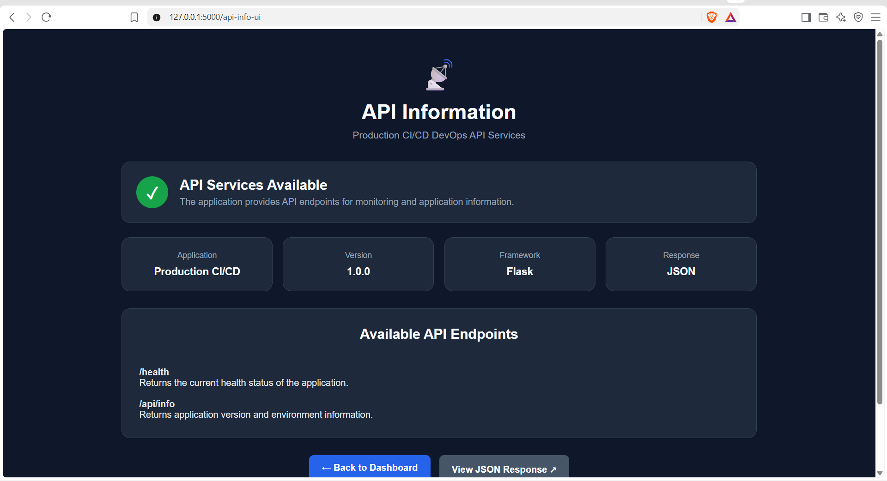
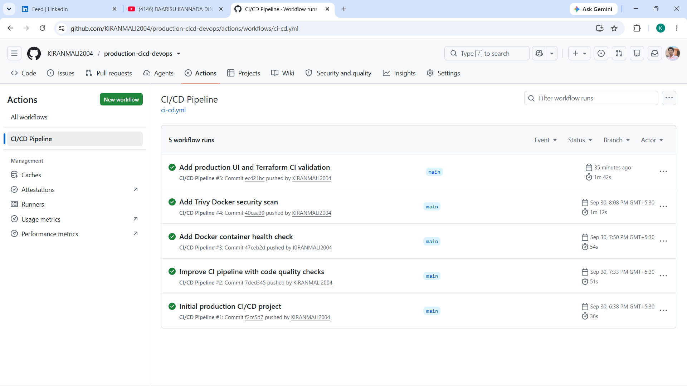
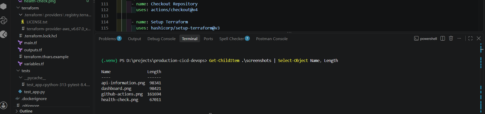

# 🚀 Production-Style CI/CD Pipeline with Docker, GitHub Actions, AWS & Terraform

A production-style DevOps project demonstrating how a Flask web application can be tested, containerized, security-scanned, and prepared for cloud deployment using modern CI/CD and Infrastructure as Code practices.

The project uses **GitHub Actions** to automate code quality checks, testing, Docker image creation, security scanning with Trivy, container health verification, and Terraform infrastructure validation.
---

## 📌 Project Overview

This project demonstrates a complete DevOps workflow:

```text
Developer
    ↓
Git Push
    ↓
GitHub
    ↓
GitHub Actions
    ↓
Ruff
    ↓
Pytest
    ↓
Docker Build
    ↓
Trivy Security Scan
    ↓
Docker Container Health Check
    ↓
Terraform Validation
    ↓
AWS Infrastructure
```

The Flask application provides a simple production-style dashboard along with health-check and API information endpoints.

---

## 🏗️ Architecture

```text
                         Developer
                             │
                             │ git push
                             ▼
                        ┌──────────┐
                        │  GitHub  │
                        └────┬─────┘
                             │
                             ▼
                    ┌─────────────────┐
                    │ GitHub Actions  │
                    └────────┬────────┘
                             │
              ┌──────────────┼──────────────┐
              ▼              ▼              ▼
           Ruff           Pytest         Docker
       Code Quality      Testing          Build
                                             │
                                             ▼
                                          Trivy
                                     Security Scan
                                             │
                                             ▼
                                    Container Test
                                             │
                                             ▼
                                      Terraform
                                       Validate
                                             │
                                             ▼
                                         AWS
                                   ┌─────────────┐
                                   │     ECR     │
                                   │     EC2     │
                                   │     VPC     │
                                   └─────────────┘
```

---

# 🧰 Technologies Used

| Technology     | Purpose                         |
| -------------- | ------------------------------- |
| Python         | Application development         |
| Flask          | Web application framework       |
| Pytest         | Automated testing               |
| Ruff           | Python code quality and linting |
| Git            | Version control                 |
| GitHub         | Source code repository          |
| GitHub Actions | CI/CD automation                |
| Docker         | Application containerization    |
| Trivy          | Container security scanning     |
| Terraform      | Infrastructure as Code          |
| AWS ECR        | Docker image registry           |
| AWS EC2        | Application hosting             |
| AWS VPC        | Network infrastructure          |
| Linux          | Cloud server environment        |

---

# 🌐 Flask Application

The project contains a Flask web application with a professional dashboard.

### Application Features

* Production-style dashboard
* Application health monitoring
* API information
* Docker container support
* CI/CD pipeline integration
* AWS deployment preparation

### Application Endpoints

| Endpoint       | Purpose                                       |
| -------------- | --------------------------------------------- |
| `/`            | Main application dashboard                    |
| `/health`      | JSON health-check endpoint used by automation |
| `/health-ui`   | Professional health-check interface           |
| `/api/info`    | JSON application information                  |
| `/api-info-ui` | API information interface                     |

---

# 🔄 CI/CD Pipeline

GitHub Actions automatically runs the following workflow whenever code is pushed to the `main` branch or a pull request targets `main`.

## Pipeline Stages

### 1. Code Quality — Ruff

Ruff checks the Python source code for formatting and code-quality issues.

```text
ruff check .
```

Result:

```text
All checks passed!
```

---

### 2. Automated Testing — Pytest

Pytest runs the application's automated tests.

Current test result:

```text
3 passed
```

This helps verify that the Flask application behaves as expected before creating the Docker image.

---

### 3. Docker Image Build

The application is packaged into a Docker image.

```text
production-cicd-devops:latest
```

Docker provides a consistent runtime environment for local development and deployment.

---

### 4. Security Scan — Trivy

Trivy scans the Docker image for known vulnerabilities.

The pipeline checks both:

* Operating-system packages
* Application libraries

Unfixed vulnerabilities are ignored by the configured CI policy so that the pipeline can continue while still displaying the scan results.

---

### 5. Docker Container Health Check

The CI pipeline starts the Docker container and verifies the application using:

```text
http://localhost:5000/health
```

The endpoint returns:

```json
{
  "status": "healthy"
}
```

This confirms that the application successfully starts inside the container.

---

### 6. Terraform Validation

Terraform is automatically validated after the Docker stage.

The pipeline performs:

```text
terraform fmt -check
terraform init -backend=false
terraform validate
```

This ensures that the Infrastructure as Code configuration is syntactically valid before any infrastructure deployment.

---

# 🐳 Docker

The application uses Docker to package the Flask application and its dependencies into a portable container.

### Dockerfile

The image is based on:

```text
python:3.12-slim
```

The container:

1. Creates the application working directory
2. Installs Python dependencies
3. Copies the Flask application
4. Exposes port `5000`
5. Runs the application using Gunicorn

The application can be started locally using:

```powershell
docker build -t production-cicd-devops:latest .
```

Then:

```powershell
docker run -d --name production-cicd-container -p 5000:5000 production-cicd-devops:latest
```

Open:

```text
http://127.0.0.1:5000
```

---

# 🔒 Trivy Security Scanning

Trivy is integrated into the GitHub Actions pipeline to scan the Docker image for known vulnerabilities.

The scan checks:

```text
Docker Image
     ↓
OS Packages
     ↓
Python Libraries
     ↓
Known Vulnerabilities
```

This adds a security verification stage before the application proceeds through the pipeline.

---

# 🏗️ Terraform — Infrastructure as Code

Terraform is used to define the AWS infrastructure required for the application.

The Terraform configuration includes:

* AWS VPC
* Public subnet
* Internet Gateway
* Route table
* Security group
* EC2 instance
* Amazon ECR repository

### AWS Architecture

```text
                         AWS
                          │
                         VPC
                          │
                  ┌───────┴────────┐
                  │                │
             Public Subnet     Internet
                  │              Gateway
                  │
              ┌───┴────┐
              │  EC2   │
              │ Docker │
              │ Flask  │
              └────────┘

              Amazon ECR
                  │
                  │
             Docker Image
```

The Terraform configuration is currently **validated and ready for deployment**, but the AWS infrastructure has not been applied in this project phase.

This avoids creating unnecessary AWS resources and cloud costs during development.

---

# 📸 Project Screenshots

## 1. Application Dashboard

The main dashboard displays the running Flask application and provides an overview of the complete CI/CD pipeline from GitHub to AWS.



---

## 2. Application Health Check

The Health Check page confirms that the Flask application is running successfully inside the Docker container and returning HTTP 200 OK.



---

## 3. API Information

The API Information page displays the application's version, environment, and API details.



---

## 4. GitHub Actions CI/CD Pipeline

GitHub Actions automatically executes code-quality checks, tests, Docker build, Trivy security scanning, container health checks, and Terraform validation.



---

## 5. Terraform Infrastructure

Terraform is used to define the AWS infrastructure as code, including the VPC, public subnet, security group, EC2 instance, and ECR repository.



---

# 📁 Project Structure

```text
production-cicd-devops/
│
├── app/
│   ├── __init__.py
│   ├── app.py
│   │
│   ├── templates/
│   │   ├── index.html
│   │   ├── health.html
│   │   └── api_info.html
│   │
│   └── static/
│       └── style.css
│
├── tests/
│   └── test_app.py
│
├── terraform/
│   ├── main.tf
│   ├── variables.tf
│   ├── outputs.tf
│   ├── terraform.tfvars.example
│   └── .terraform.lock.hcl
│
├── .github/
│   └── workflows/
│       └── ci-cd.yml
│
├── screenshots/
│   ├── dashboard.png
│   ├── health-check.png
│   ├── api-information.png
│   ├── github-actions.png
│   └── terraform.png
│
├── Dockerfile
├── .dockerignore
├── .gitignore
├── requirements.txt
└── README.md
```

---

# ▶️ Run the Project Locally

## 1. Clone the repository

```powershell
git clone https://github.com/KIRANMALI2004/production-cicd-devops.git
```

Move into the project:

```powershell
cd production-cicd-devops
```

---

## 2. Create a Virtual Environment

```powershell
python -m venv .venv
```

Activate it:

```powershell
.\.venv\Scripts\Activate.ps1
```

---

## 3. Install Dependencies

```powershell
pip install -r requirements.txt
```

---

## 4. Run Tests

```powershell
pytest
```

Expected result:

```text
3 passed
```

---

## 5. Run Ruff

```powershell
ruff check .
```

Expected result:

```text
All checks passed!
```

---

## 6. Run Flask

```powershell
python -m flask --app app.app run
```

Open:

```text
http://127.0.0.1:5000
```

---

# 🐳 Run with Docker

Build the image:

```powershell
docker build -t production-cicd-devops:latest .
```

Run the container:

```powershell
docker run -d --name production-cicd-container -p 5000:5000 production-cicd-devops:latest
```

Open:

```text
http://127.0.0.1:5000
```

Check the container:

```powershell
docker ps
```

Stop the container:

```powershell
docker stop production-cicd-container
```

Remove the container:

```powershell
docker rm production-cicd-container
```

---

# ☁️ AWS Deployment Preparation

Terraform is configured for AWS deployment using:

```text
AWS Region: ap-south-1
Instance Type: t3.micro
```

The planned infrastructure includes:

```text
VPC
 └── Public Subnet
      └── EC2
           └── Docker
                └── Flask Application

Amazon ECR
 └── Docker Image Repository
```

The current project phase focuses on local Docker execution, CI/CD automation, security scanning, and Terraform validation.

Actual AWS infrastructure deployment can be performed as a separate deployment phase.

---

# 🧪 Project Validation

The project has been validated using:

```text
✓ Flask application
✓ Pytest
✓ Ruff
✓ Docker build
✓ Docker container
✓ Application health check
✓ Trivy security scan
✓ Terraform formatting
✓ Terraform initialization
✓ Terraform validation
✓ GitHub Actions CI/CD
```

GitHub Actions successfully completed the CI/CD workflow.

---

# 💼 Interview Explanation

### Short Version

> I built a production-style CI/CD DevOps project using Flask, Docker, GitHub Actions, Trivy, and Terraform. I developed a Flask application with health-check and API endpoints, containerized it using Docker, and created a GitHub Actions pipeline that automatically performs code-quality checks with Ruff, automated testing with Pytest, Docker image building, Trivy security scanning, container health verification, and Terraform validation. I also prepared Terraform configuration for AWS infrastructure including VPC, subnet, security group, EC2, and ECR.

### Technical Explanation

The workflow starts when a developer pushes code to GitHub. GitHub Actions first runs Ruff for code quality and then Pytest for automated testing. If those stages succeed, the pipeline builds the Docker image and scans it with Trivy for known vulnerabilities.

The pipeline then starts the Docker container and performs an application health check. Finally, Terraform is initialized and validated to ensure that the AWS Infrastructure as Code configuration is correct.

The Terraform configuration defines the AWS resources required for future deployment, including the VPC, public subnet, security group, EC2 instance, and ECR repository.

---

# 🎯 Key DevOps Concepts Demonstrated

* Continuous Integration
* Continuous Delivery
* Infrastructure as Code
* Containerization
* Automated Testing
* Code Quality Automation
* Container Security
* Cloud Infrastructure
* AWS Architecture
* Git-based Development Workflow
* Infrastructure Validation
* Application Health Monitoring

---

# 👨‍💻 Author

**Kiran Mali**

B.E. Computer Science & Engineering

GitHub:
https://github.com/KIRANMALI2004

LinkedIn:
https://www.linkedin.com/in/kiran-mali-375a28308/

---

## ⭐ Project Goal

The goal of this project is to demonstrate how a software application can move from source code to a tested, containerized, security-checked, and cloud-ready deployment using modern DevOps tools and practices.
